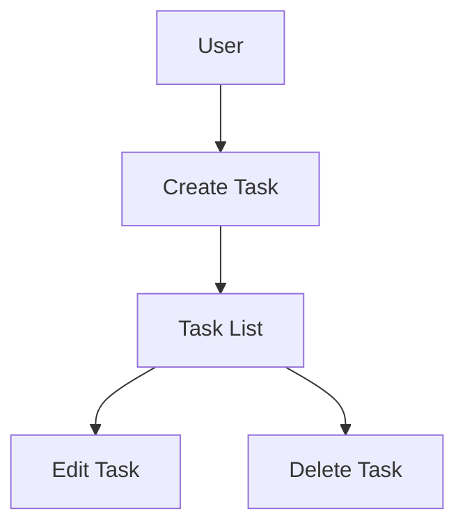

# CLAUDE.md — Guidelines for Claude Code

## Project Overview

SharePoint MCP Server — An MCP server built with Python 3.10+ that connects LLM applications to SharePoint via the Microsoft Graph API.
This document defines the rules and conventions all contributors (human and AI) must follow.

---

## Directory Structure

| Path | Description |
|------|-------------|
| `server.py` | MCP server entry point |
| `auth/` | Authentication modules |
| `tools/` | MCP tool definitions |
| `resources/` | MCP resource definitions |
| `utils/` | Shared utilities |
| `tests/` | pytest test suite |

---

## Document Management

### Document Classification

#### 1. Persistent Documents (`docs/`)

These documents define **what we build** and **how we build it** for the entire application.
They are updated only when fundamental design decisions change.

| File | Description |
|------|-------------|
| `docs/product-requirements.md` | Product vision, target users, key features, success criteria, business requirements, user stories, acceptance criteria, functional and non-functional requirements |
| `docs/functional-design.md` | Per-feature architecture, system diagrams, data models (ER diagrams), component design, use case diagrams, screen transitions, wireframes, API design |
| `docs/architecture.md` | Technology stack, development tools and methodology, technical constraints, performance requirements |
| `docs/repository-structure.md` | Folder and file layout, directory roles, file placement rules |
| `docs/development-guidelines.md` | Coding conventions, naming rules, styling guidelines, testing standards, Git conventions |
| `docs/glossary.md` | Domain terminology, business terms, UI/UX terms, English–Japanese glossary, naming conventions in code |

#### 2. Task-Scoped Documents (`.steering/[YYYYMMDD]-[task-title]/`)

These documents define **what we are doing right now** for a specific development task.
A new directory is created for each task. Completed directories are retained as historical records.

| File | Description |
|------|-------------|
| `requirements.md` | Feature description, user stories, acceptance criteria, constraints |
| `design.md` | Implementation approach, components to change, data structure changes, impact analysis |
| `tasklist.md` | Concrete implementation tasks, progress status, completion criteria |

### Steering Directory Naming Convention

```
.steering/[YYYYMMDD]-[task-title]/
```

**Examples:**
```
.steering/20250103-initial-implementation/
.steering/20250115-add-tag-feature/
.steering/20250120-fix-filter-bug/
.steering/20250201-improve-performance/
```

---

## Development Workflow

### Initial Setup

1. Create persistent documents in `docs/` in the order listed below.
   **Important:** After creating each file, wait for review and approval before proceeding to the next.
   1. `docs/product-requirements.md`
   2. `docs/functional-design.md`
   3. `docs/architecture.md`
   4. `docs/repository-structure.md`
   5. `docs/development-guidelines.md`
   6. `docs/glossary.md`

2. Create the steering directory for the initial implementation:
   ```bash
   mkdir -p .steering/[YYYYMMDD]-initial-implementation
   ```
   Then create the following files in order (approval required after each):
   - `requirements.md`
   - `design.md`
   - `tasklist.md`

3. Proceed with implementation based on `tasklist.md`.

4. Run quality checks (see [Quality Checks](#quality-checks) below).

### Feature Addition / Bug Fix Workflow

1. **Impact Analysis** — Review persistent documents in `docs/` for any design-level impact. Update `docs/` if fundamental design is affected.

2. **Create a steering directory:**
   ```bash
   mkdir -p .steering/[YYYYMMDD]-[task-title]
   # Example: mkdir -p .steering/20250115-add-tag-feature
   ```

3. **Create task-scoped documents** (approval required after each file):
   1. `requirements.md`
   2. `design.md`
   3. `tasklist.md`

4. **Implement** based on `tasklist.md`.

5. **Quality Checks** (see below).

---

## Issue Response Procedure

1. Read the Issue and understand the reproduction steps, expected behavior, and actual behavior.
2. Identify the relevant code.
3. Create a branch using the naming convention: `fix/issue-{number}-{summary}`
4. Implement the fix and verify all existing tests pass (`pytest`).
5. Add new tests if needed.
6. Create a PR that references the Issue: `Closes #[number]`

**Commit message format:**
```
fix: #[issue-number] - brief description of the change
```

---

## Quality Checks

After every implementation, run the following:

```bash
# Code formatting
black .

# Linting
ruff check .

# Tests
pytest
```

All checks must pass before creating a PR.

---

## Diagrams and Visuals

### Placement

Diagrams are embedded directly within the relevant persistent document — no separate `diagrams/` folder.

| Diagram Type | Location |
|---|---|
| ER diagrams, data models | `functional-design.md` |
| Use case diagrams | `functional-design.md` or `product-requirements.md` |
| Screen transitions, wireframes | `functional-design.md` |
| System architecture diagrams | `functional-design.md` or `architecture.md` |

### Format

Prefer **Mermaid** (embeds in Markdown, version-controlled, no tooling required):



Use **ASCII art** only for simple diagrams. Keep diagrams minimal to reduce maintenance cost.

---

## Development Rules

- **Code style:** `black` + `ruff`
- **Tests:** `pytest` (see `pytest.ini`)
- **Branch naming:** `fix/issue-{number}-{summary}`
- **Commit format:** `fix: #[issue-number] - description`

---

## Environment Variables

Refer to `.env.example` for required variables. Set actual values in `.env` (already in `.gitignore`).

---

## Important Notes

- **Never commit `.env`** — it contains secrets and is gitignored for a reason.
- Any changes to Microsoft Graph API permissions must be documented in `docs/auth_guide.md`.
- Create and update documents incrementally — obtain approval at each stage before proceeding.
- Keep steering directory names descriptive so they are self-identifying by date and purpose.
- Do not confuse persistent documents (`docs/`) with task-scoped documents (`.steering/`).
- After all code changes, run comprehensive tests.
- Follow security best practices: input validation, avoiding secret exposure, etc.