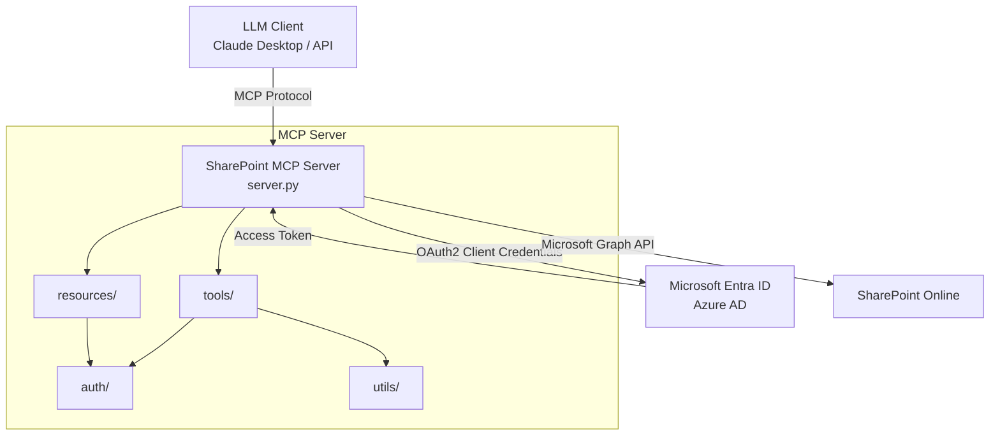
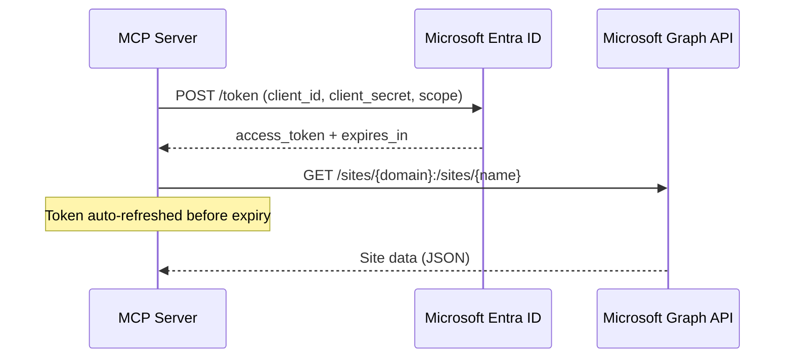
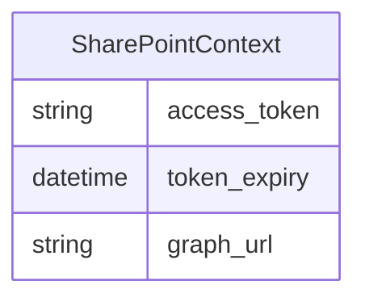
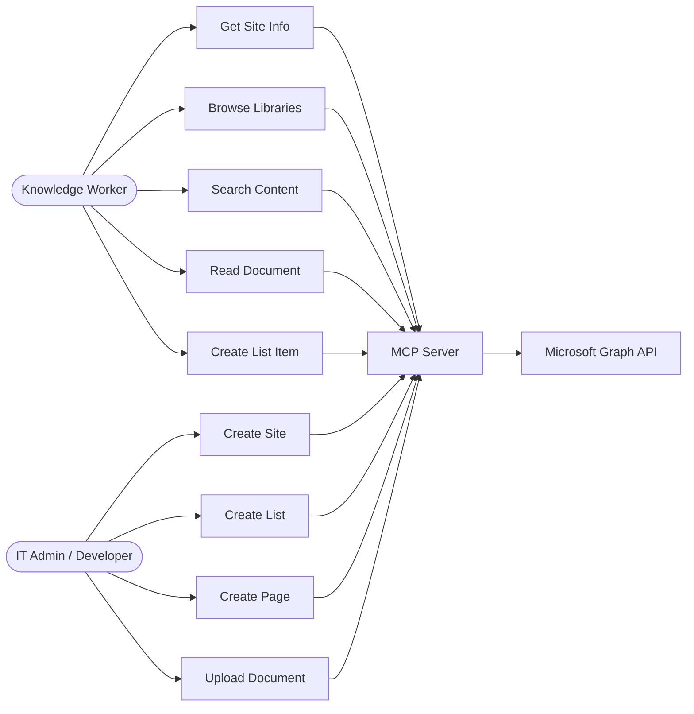

# Functional Design

> This document describes the per-feature architecture, system diagrams, data models, and component design for the SharePoint MCP Server.

---

## System Overview



---

## Authentication Flow



---

## Component Design

### server.py — Entry Point

- Creates `FastMCP` instance with `sharepoint_lifespan` context manager
- Lifespan acquires an access token at startup and yields `SharePointContext`
- On error, yields a fallback error context (tools will surface auth errors gracefully)
- Registers all tools via `register_site_tools(mcp)`

### auth/sharepoint_auth.py — Authentication

| Class / Function | Responsibility |
|-----------------|----------------|
| `SharePointContext` | Dataclass holding `access_token`, `token_expiry`, `graph_url`; provides `headers` property and `is_token_valid()` / `test_connection()` methods |
| `get_auth_context()` | Acquires token via MSAL client credentials flow; returns `SharePointContext` |
| `refresh_token_if_needed()` | Checks token validity and refreshes if expired |

### tools/site_tools.py — MCP Tools

All tools follow the same pattern:

```
1. Get SharePointContext from lifespan context
2. _check_auth() — raise if token is invalid
3. refresh_token_if_needed()
4. Instantiate GraphClient
5. Call Graph API method
6. Return JSON-serialized result
```

| Tool | Graph API Operation |
|------|-------------------|
| `get_site_info` | `GET /sites/{domain}:/sites/{name}` |
| `list_document_libraries` | `GET /sites/{id}/drives` |
| `search_sharepoint` | `POST /sites/{id}/search` |
| `create_sharepoint_site` | `POST /sites` (group site) |
| `create_intelligent_list` | `POST /sites/{id}/lists` with schema |
| `create_list_item` | `POST /sites/{id}/lists/{listId}/items` |
| `update_list_item` | `PATCH /sites/{id}/lists/{listId}/items/{itemId}` |
| `create_advanced_document_library` | `POST /sites/{id}/drives` |
| `upload_document` | `PUT /sites/{id}/drives/{driveId}/root:/{path}/{file}:/content` |
| `create_modern_page` | `POST /sites/{id}/pages` |
| `create_news_post` | `POST /sites/{id}/pages` (news template) |
| `get_document_content` | `GET /sites/{id}/drives/{driveId}/items/{itemId}/content` |

### utils/graph_client.py — HTTP Client

- Wraps `requests` library for Microsoft Graph API calls
- Methods: `get()`, `post()`, `patch()`, `put_binary()`, `get_site_info()`, `list_document_libraries()`, etc.
- Raises `Exception` with Graph API error code on non-2xx responses

### utils/document_processor.py — Document Parsing

| File Type | Library | Output |
|-----------|---------|--------|
| CSV | pandas | rows, columns, preview, summary |
| XLSX / XLS | pandas + openpyxl | per-sheet rows, columns, preview |
| DOCX | python-docx | paragraphs, tables, headings, metadata |
| PDF | PyPDF2 | text by page, metadata, form fields |
| TXT / MD / HTML | built-in | lines, word count, format detection |

### utils/content_generator.py — AI Content Generation

- Generates page titles and content based on `purpose` and `audience`
- Maps purpose strings to SharePoint page templates
- Used by `create_modern_page` tool

### resources/site.py — MCP Resources

- Registers `sharepoint://site-info` as an MCP resource
- Returns JSON with site name, description, creation date, and URL

### config/settings.py — Configuration

- Loads environment variables from `.env` via `python-dotenv`
- Exposes `SHAREPOINT_CONFIG` dict and `APP_NAME`, `DEBUG` constants

---

## Data Models

### SharePointContext



| Field | Type | Description |
|-------|------|-------------|
| `access_token` | `str` | Bearer token for Microsoft Graph API |
| `token_expiry` | `datetime \| None` | UTC datetime when token expires |
| `graph_url` | `str` | Base URL (default: `https://graph.microsoft.com/v1.0`) |

### Tool Input / Output

All tools accept a `Context` object (MCP) plus typed parameters, and return a JSON string.

---

## Error Handling

| Scenario | Behavior |
|----------|----------|
| Auth failure at startup | Error context created; all tools raise descriptive exception |
| Invalid / expired token | `_check_auth()` raises before Graph API call |
| Graph API non-2xx | `GraphClient` raises `Exception("Graph API error: {status} - {body}")` |
| Document parse failure | `DocumentProcessor` returns `{"error": "..."}` dict |
| Tool exception | FastMCP marks tool call as error and surfaces message to LLM |

---

## Use Case Diagram


